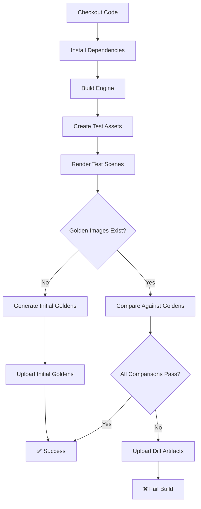

# Golden Image CI System

## Overview

The Golden Image CI system provides automated visual regression testing for Glint3D by comparing rendered outputs against reference "golden" images using SSIM (Structural Similarity Index) and pixel-level metrics.

## Acceptance Criteria

✅ **Desktop Comparison**: SSIM ≥ 0.995 OR per-channel Δ ≤ 2 LSB  
✅ **Web vs Desktop**: SSIM ≥ 0.990  
✅ **CI Artifacts**: Diff images + heatmaps uploaded on failure

## System Architecture

### Components

1. **Golden Test Scenes** (`examples/json-ops/golden-tests/`)
   - `basic-lighting.json` - Point light with sphere
   - `directional-lighting.json` - Directional light with cube
   - `spot-lighting.json` - Spot light with plane and sphere
   - `camera-presets.json` - Camera positioning consistency
   - `tone-mapping.json` - Exposure and tone mapping controls

2. **Python Comparison Tools** (`tools/`)
   - `golden_image_compare.py` - Main SSIM comparison engine
   - `generate_goldens.py` - Golden reference image generator
   - `requirements.txt` - Python dependencies

3. **CI Integration** (`.github/workflows/ci.yml`)
   - `validate-golden-images` job for automated testing
   - Artifact upload for failures and diagnostics
   - Automatic golden generation if missing

## CI Workflow

### Validation Pipeline



### Job Triggers

- **Every Push/PR**: Validates against existing golden images
- **Workflow Dispatch**: Regenerates golden candidates for review
- **Manual**: Local testing via `test_golden_system.py`

## Test Assets

The CI creates minimal OBJ models for consistent testing:

- **Sphere**: Octahedron approximation (8 vertices, 8 faces)
- **Cube**: Standard cube geometry (8 vertices, 6 faces)  
- **Plane**: Simple quad (4 vertices, 1 face)

These ensure tests run without external asset dependencies.

## Comparison Metrics

### SSIM (Structural Similarity Index)
- **Range**: 0.0 (completely different) to 1.0 (identical)
- **Usage**: Perceptual similarity measurement
- **Thresholds**: 0.995 (desktop), 0.990 (cross-platform)

### Per-Channel Difference
- **Range**: 0-255 (8-bit color values)
- **Usage**: Exact pixel matching
- **Threshold**: ≤ 2 LSB for desktop comparisons

### Additional Metrics
- **MSE**: Mean Squared Error for numerical difference
- **RMSE**: Root Mean Square Error (normalized 0-1)

## Failure Artifacts

When comparisons fail, the system generates:

### Diff Images
- Side-by-side: Rendered | Golden | Difference (5x enhanced)
- Labels and annotations for clear identification
- PNG format with embedded metadata

### SSIM Heatmaps
- Color-coded similarity map (blue=similar, red=different)
- Matplotlib-generated with colorbar legend
- High DPI output for detailed analysis

### JSON Reports
```json
{
  "comparison_type": "desktop",
  "total_comparisons": 5,
  "passed_comparisons": 4,
  "results": [
    {
      "filename": "basic-lighting.png",
      "ssim_score": 0.9987,
      "max_channel_diff": 1,
      "passed": true,
      "threshold_used": "Desktop (SSIM ≥ 0.995 OR channel Δ ≤ 2)"
    }
  ]
}
```

## Local Testing

### Quick Test
```bash
# Run complete validation suite
python test_golden_system.py
```

### Manual Steps
```bash
# 1. Install dependencies
pip install -r tools/requirements.txt

# 2. Generate golden references
python tools/generate_goldens.py builds/desktop/cmake/Release/glint.exe \
  --asset-root test_assets

# 3. Compare new renders
python tools/golden_image_compare.py \
  --batch renders/ examples/golden/ --verbose
```

## Golden Image Management

### Initial Setup
```bash
# Generate first set of golden images
python tools/generate_goldens.py <engine_binary> \
  --test-dir examples/json-ops/golden-tests \
  --golden-dir examples/golden \
  --asset-root test_assets
```

### Updating Goldens

When intentional rendering changes require new references:

1. **Verify Changes**
   ```bash
   # Compare current vs golden
   python tools/golden_image_compare.py --batch renders/ examples/golden/ --verbose
   ```

2. **Regenerate References**
   ```bash
   # Create new golden set
   python tools/generate_goldens.py <engine_binary> \
     --golden-dir examples/golden --asset-root test_assets
   ```

3. **Commit Updates**
   ```bash
   git add examples/golden/
   git commit -m "Update golden images for [reason]"
   ```

### CI Golden Regeneration

Use GitHub's workflow dispatch to generate candidate goldens:

1. Go to Actions → CI workflow
2. Click "Run workflow"  
3. Set "regenerate_goldens" to "true"
4. Download `golden-candidates-linux` artifact
5. Review and replace `examples/golden/` if acceptable

## Platform Considerations

### Linux CI Environment
- Uses Mesa software rendering via Xvfb
- Consistent headless environment  
- UTC timezone and C locale

### Cross-Platform Differences
- Different GPU drivers may produce slight variations
- Floating-point precision differences
- Use relaxed thresholds for cross-platform comparisons

### Web vs Desktop
- WebGL2 vs OpenGL differences
- JavaScript vs C++ precision
- Separate comparison thresholds (SSIM ≥ 0.990)

## Troubleshooting

### Common Issues

**"Golden images not found"**
- CI will automatically generate initial set
- Download from artifacts and commit to repository

**High false positive rate**
- Check platform consistency
- Adjust thresholds if needed
- Verify test asset consistency

**Python dependency errors**
```bash
# Install specific versions
pip install -r tools/requirements.txt --force-reinstall
```

**Render failures**
- Check engine binary path
- Verify asset root contains required models
- Check JSON scene syntax

### Debug Commands

```bash
# Verbose comparison with all metrics
python tools/golden_image_compare.py rendered.png golden.png --verbose

# Generate debug artifacts
python tools/golden_image_compare.py \
  --batch renders/ goldens/ --output debug_artifacts/

# Test single scene rendering  
./builds/desktop/cmake/Release/glint \
  --asset-root test_assets \
  --ops examples/json-ops/golden-tests/basic-lighting.json \
  --render debug.png --w 400 --h 300 --log debug
```

## Configuration

### Threshold Tuning
Edit `tools/golden_image_compare.py`:
```python
DESKTOP_SSIM_THRESHOLD = 0.995          # Adjust for strictness
DESKTOP_CHANNEL_DIFF_THRESHOLD = 2      # LSB tolerance  
WEB_VS_DESKTOP_SSIM_THRESHOLD = 0.990   # Cross-platform
```

### Render Settings
Default test resolution: 400x300 pixels
- Small enough for fast CI execution
- Large enough to detect visual regressions
- Configurable via generator scripts

### Scene Coverage
Current test scenes cover:
- ✅ Point/Directional/Spot lighting
- ✅ Camera presets and positioning  
- ✅ Tone mapping and exposure
- ❌ Material variations (future)
- ❌ Complex geometry (future)
- ❌ Animation/temporal consistency (future)

## Integration with Development Workflow

### Pre-commit Validation
```bash
# Quick local check before committing
python test_golden_system.py
```

### PR Validation  
- CI automatically runs on all PRs
- Failures block merging until resolved
- Artifacts available for investigation

### Release Validation
- Full golden suite runs on release branches
- Cross-platform validation
- Performance regression detection

## Future Enhancements

### Planned Improvements
- **Performance metrics**: Render time tracking
- **Memory usage**: RAM/VRAM monitoring  
- **Animation testing**: Multi-frame sequences
- **Material coverage**: PBR parameter variations
- **Lighting scenarios**: Complex multi-light setups
- **Web testing**: Automated browser-based validation

### Tool Enhancements
- **Automatic threshold tuning**: Statistical analysis of failure rates
- **Regression detection**: Temporal comparison tracking
- **Visual diff tools**: Interactive comparison interface
- **Integration**: IDE plugins and git hooks

## Support and Maintenance

### Monitoring
- Track CI failure rates and common issues
- Monitor artifact storage usage
- Performance trend analysis

### Maintenance Tasks
- Regular threshold validation
- Golden image cleanup and optimization
- Test scene coverage expansion
- Documentation updates

For questions or issues with the golden image system, check:
1. This documentation
2. `tools/README.md` for tool-specific help
3. CI logs and artifacts for failure analysis
4. GitHub issues for known problems